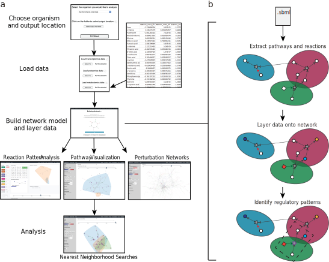
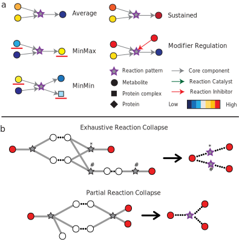

# 

[](https://github.com/Metaboverse/Metaboverse/releases/)
[](https://www.biorxiv.org/content/10.1101/2020.06.25.171850)
[](https://zenodo.org/badge/latestdoi/203264184)

## What does Metaboverse do?
Integrating multi- or single-omic metabolic data upon the metabolic network can be challenging for a variety of reasons. Metaboverse seeks to simplify this task for users by providing a simple, user-friendly interface for layering their data on a dynamic representation of the metabolic network and automatically searching the network for interesting regulatory or other patterns. Additionally, Metaboverse provides several tools to enable the contextualization of metabolic data.

## Citing Metaboverse
If you use Metaboverse in your data analysis, please cite as:
```
Berg JA, Zhou Y, Ouyang Y, Waller TC, Cluntun AA, Conway ME, Nowinski SM, Van Ry T, George I,
Cox JE, Wang B, Rutter J.
Metaboverse: Automated discovery and visualization of diverse metabolic regulatory patterns.
bioRxiv. (2020) doi: https://www.biorxiv.org/content/10.1101/2020.06.25.171850
```

### Metaboverse provides a simple, dynamic user interface for processing and exploring multi-omics datasets
<details><summary>Show figure legend</summary>
<div style="font-size: .5rem;">
<i>
<b>a.</b> The user provides the name of the organism of interest from a drop-down menu along with an output location. The user then has the option to provide transcriptomics, proteomics, and/or metabolomics datasets. These datasets can be single- or multi-condition or time-course experiments. Data is formatted as follows: row names are the measured entity names or IDs, the first column is a log2(fold change) or other measurement value, and the second column is a statistical measurement. For time-course and multi-condition datasets, this pattern is repeated for each subsequent sample. During this step, the user can also provide sample labels and other modifiers to customize the curation and display of the data on the curated reaction network. Metaboverse will then build the model. Once the model is complete, the user will be able to visualize the patterns identified within reactions, explore pathway-specific or general perturbation networks, and perform general pathway and nearest reaction neighborhood exploration of the data. <b>b.</b> Overview of back-end metabolic network curation and data layering.
</i>
</div>
</details>

<div align="center">

   

</div> 

### Overview of reaction pattern construction and reaction collapsing
<details><summary>Show figure legend</summary>
<div style="font-size: .5rem;">
<i>
<b>a.</b> Examples of a selection of reaction patterns available in Metaboverse. Reactions are depicted as stars, metabolites as circles, protein complexes as squares, and proteins as diamonds. Core interactions (inputs, outputs) are depicted as grey arrows, reaction catalysts as green arrows, and reaction inhibitors as red arrows. Component measurements are depicted in a blue-to-red color map, where lower values are more blue and higher values are more red. <b>b.</b> Example sub-networks where a reaction collapse would occur. Measured components are depicted as red circles, unmeasured components as white circles, and reactions as stars. Core interactions (inputs, outputs) are depicted as grey lines and identical components that would form the bridge between two reactions are depicted as dashed black lines between circles. A collapsed reaction is depicted as a star with a dashed border and its new connections between measured components are dashed black lines between a measured component and a reaction node. Collapsed reactions representing a particular reaction sequence are marked by an asterisk (∗) or a number sign (#).
</i>
</div>
</details>

<div align="center">

  

</div>  


### Walkthroughs

Detailed walkthroughs and additional usage information can be found in the [documentation](https://metaboverse.readthedocs.io/en/latest).

<div align="center">
   
[](http://www.youtube.com/watch?v=G1PWjQJ7J0I "Metaboverse video walkthrough")
   
</div>

## Getting started

### Requirements
- An internet connection for network curation
- The most current version of the [Metaboverse app](https://github.com/Metaboverse/Metaboverse/releases) for your operating system
- A Linux/macOS/Windows 64-bit operating system
- At least 4 GB RAM and 5 GB of free storage space

### Installation
- Download the appropriate Metaboverse app `.zip` file for your operating system from [this location](https://github.com/Metaboverse/Metaboverse/releases/latest).
- Unzip the downloaded folder
- Open the `Metaboverse` app
- Please refer to the [documentation](https://metaboverse.readthedocs.io/en/latest/content/general-usage.html) for more information in using the app.
- If you would like to use an example dataset, this is labeled `test_data.zip` and can be found within the `Metaboverse` app folder.

### Testing out Metaboverse
With each release archive or Metaboverse, a `test_data.zip` file is included. Unzip this file and read the `README.txt` file for more information on this example dataset. 

## Getting Help
- If you have questions, requests, or bugs to report, please use the [Metaboverse issues forum](https://github.com/Metaboverse/Metaboverse/issues). - Please clearly describe the problem, what you have tried, as well as screenshots of any error information.     
- Generally, for any errors occurring during network building, a file named `metaboverse_session.log` will be output to your specified Output folder. If you receive this file, please upload it to your GitHub Issue. This will output a lot of information, but you can try self-diagnosing by seeing if there is anything in the last ~10-15 lines of this file that might hint at the issue. Otherwise, we are happy to help diagnose the problem!    
- It is also often helpful for us to click on the `View` menu tab, click `Toggle Developer Tools`, click the `Console` tab of the window that opens, and take a screenshot of the output in this panel.

## Feedback
- Have any feedback? Let us know [here](https://forms.gle/4z51DMnagWRvKhc38).
- We also have a discussion forum [here](https://github.com/Metaboverse/Metaboverse/discussions).

   
