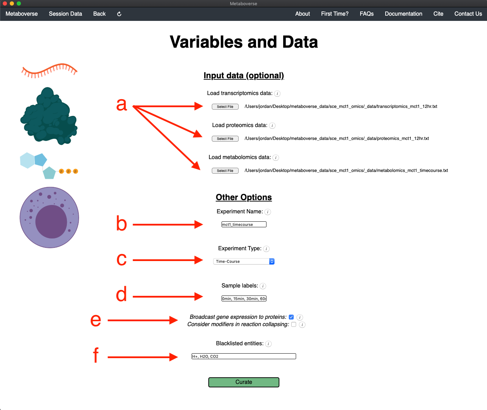
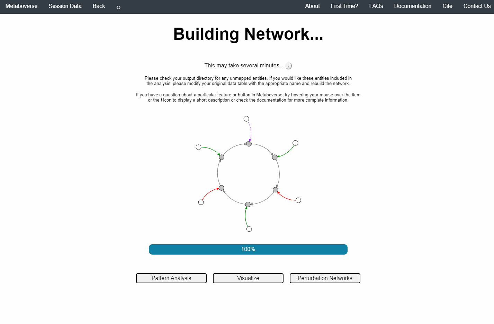
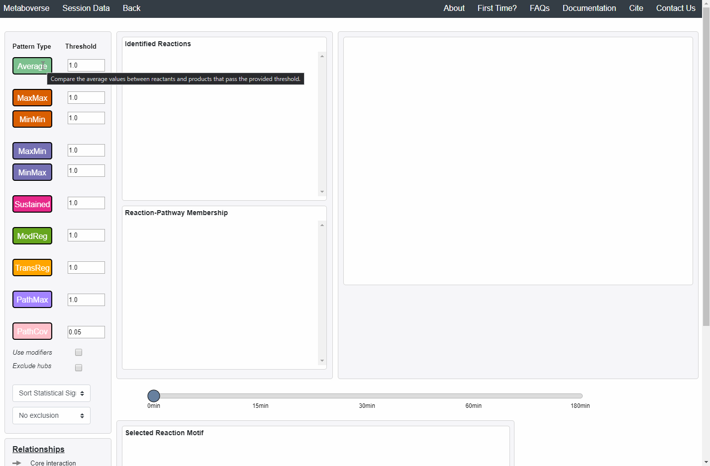
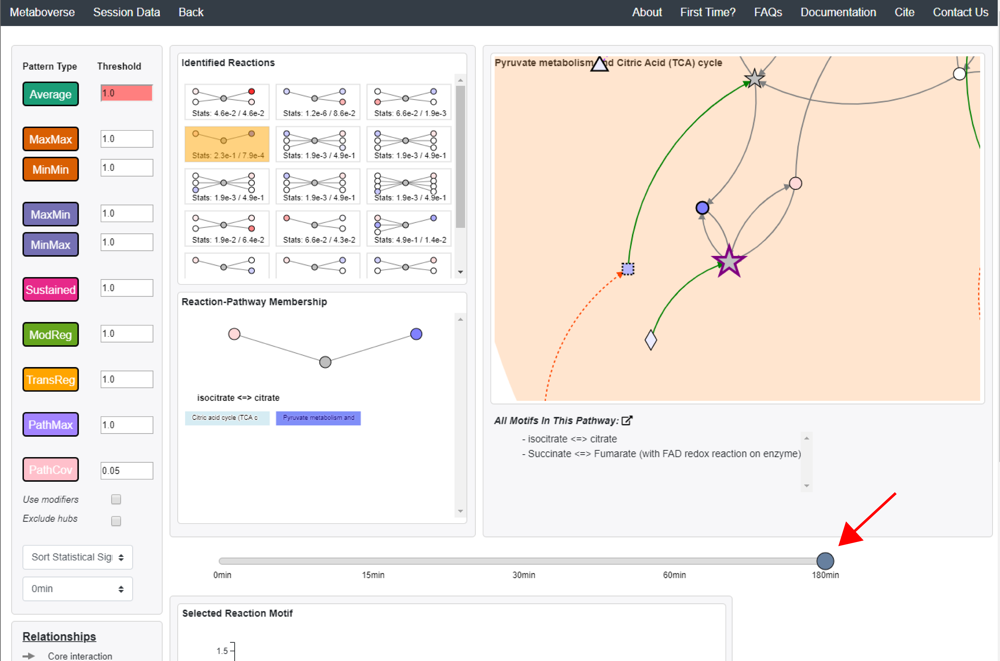
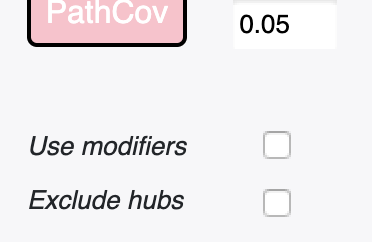
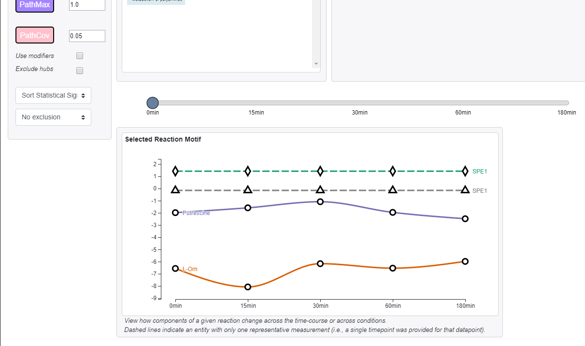
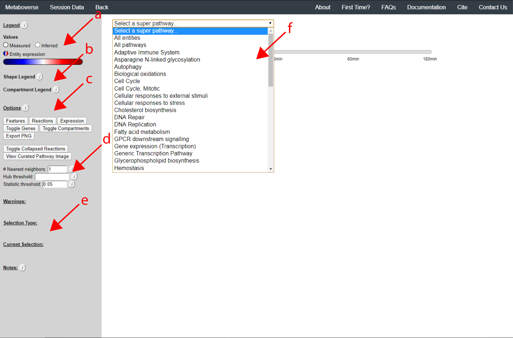
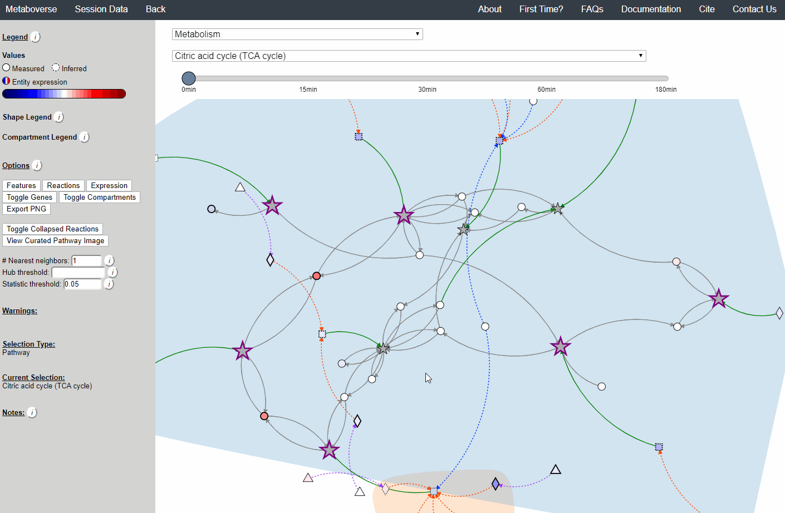
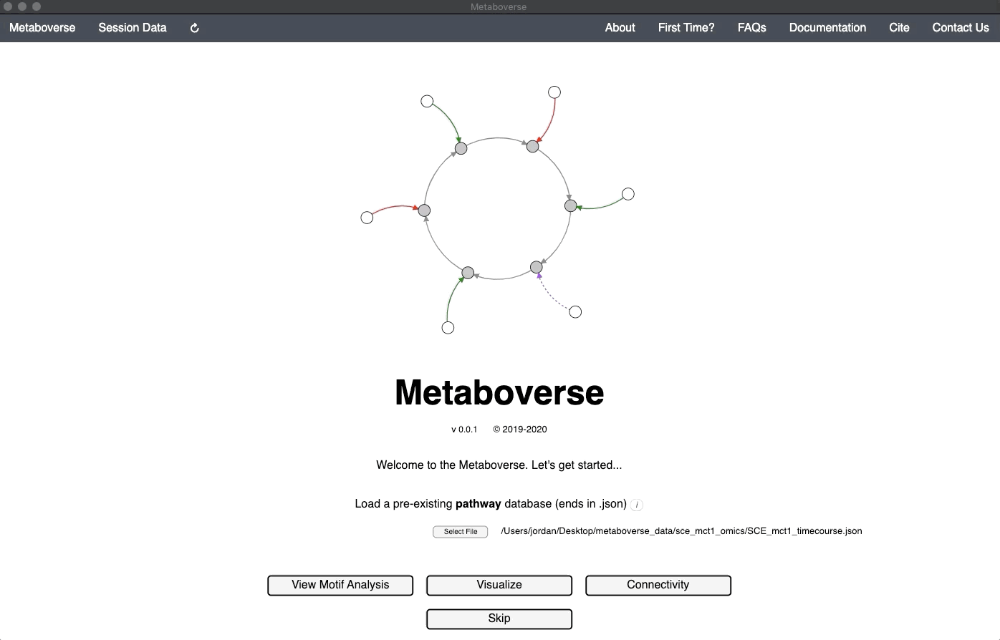

.. _general_link:

#############
General Usage
#############

| The following walkthrough was created using Metaboverse :data:`v0.3.2b` and previous versions. If using a later version, some aspects may look/behave slightly different. We will do our best to keep these walkthroughs updated as any relevant components change. If you have any questions, please let us know `here <https://github.com/Metaboverse/Metaboverse/issues>`_.

----------------------------
Analysis Video Walkthrough
----------------------------
| You can watch the Metaboverse walkthrough video here, or continue below for a more detailed walkthrough.
.. raw:: html

    <iframe width="700" height="450" src="https://youtube.com/embed/U7m78Tbs5KE" frameborder="0" allow="accelerometer; autoplay; encrypted-media; gyroscope; picture-in-picture" allowfullscreen></iframe>
|

-------------------------
Getting Started
-------------------------
| 1. If this is your first time analyzing a given dataset, you should press :data:`Skip` on the opening page.
.. image:: images/page_one.gif
  :width: 700
  :align: center
|
| 2. Select the organism of interest you would like to model your data.
| 3. Select an output location for files generated by Metaboverse.
.. image:: images/page_two.gif
  :width: 700
  :align: center
|
| 4. Provide the following variables for your model.
| a) Provide the appropriate data files for your -omics data. Please see the :ref:`Data Inputs` sub-heading for more information.
| b) Provide a name for your experiment/model.
| c) Provide the appropriate experimental type. In this case, I am providing timecourse metabolomics data, so I will select that option.
| d) When processing a timecourse or multi-condition dataset, you will then be asked to provide the appropriate sample labels. These should be separated by commas, and should appear in the same order as listed in the dataframe.
| e) Select these modification options if desired.
|     - *Broadcast gene expression to proteins*: Check to broadcast gene expression values to proteins when protein values are not available (checked by default).
|     - *Consider modifiers in reaction collapsing*: Check to include modifiers in reaction collapsing. Catalysts are included as outputs, inhibitors are included as inputs. Please refer to documentation for more information.
| f) Add or remove any items you wish to not be displayed in the network visualizations.

|
.. image:: images/page_three.gif
  :width: 700
  :align: center
|
| 5. Build your network model. After your network model has been built, you will have the option to perform regulatory hotspot identification, model perturbation networks, or perform general visualization of pathways and components by clicking on the appropriate buttons at the bottom of the screen that will appear once Metaboverse has finished processing your data.

|
--------------------------------------------------
Regulatory Hotspot Identification (:data:`Pattern Analysis`)
--------------------------------------------------
| Regulatory patterns can be searched for in the global reaction network using this page. Users can select different reaction pattern types by clicking on the appropriate buttons and adjusting their thresholds as necessary.
|
| Currently, these reaction pattern types are available:
| 1. **Average**: A reaction whose absolute difference between the average measured values of reactants and the average measured values of products is greater than or equal to the threshold.
| 2. **MaxMax**: A reaction whose absolute difference between the maximum measured value of reactants and the maximum measured value of products is greater than or equal to the threshold.
| 3. **MaxMin**: A reaction whose absolute difference between the maximum measured value of reactants and the minimum measured value of products is greater than or equal to the threshold.
| 4. **Sustained**: Find instances of sustained perturbation along a reaction where there are both an input and an output that are not the same molecule with changes above the selected threshold.
| 5. **ModReg**: Find instances with one regulated modifier and one core component in the reaction.
| 6. **TransReg**: Find instances where a component is the same for input and output, is regulated, along with a modifier being regulated.
| 7. **PathMax**: A pathway whose absolute difference between the maximum value and the minimum value is greater than or equal to the threshold. Users can switch the type of values to be computed between the expression values and the statistical values (p-values).
| 8. **PathCov**: Compare total coverage of reactions with at least one measured component in pathways.
|
| Users can then select a given reaction pattern, view the pathways that reaction is present in across the global reaction network, select a pathway to view, and see all other patterns of that type available in that pathway. In the :data:`Reaction-Pathway Membership` box, a simplified glyph of the reaction is drawn, with inputs (substrates) on the left of the reaction node and outputs (products) on the right of the reaction node. Modifiers and input/output types are not shown in this simplified glyph.

|
| If the model includes time-course or multi-condition data, the patterns present at each timepoint or condition can be viewed.

|
| Users can also choose to include the following modifications in the reaction pattern search:
| a) **Use Modifiers**: Check to include modifiers in reaction pattern analysis. Catalysts are included as outputs, inhibitors are included as inputs. You will need to re-run the reaction pattern analysis to include modifiers.
| b) **Exclude Hubs**: Exclude high-hub components from consideration in the reaction pattern search. This will remove hubs with more than 100 connections. You will need to re-run the reaction pattern analysis to include modifiers.

|
| Additionally, users can choose how to sort identified reaction patterns, or choose to not return reaction patterns for the selected time-point or condition that were also found in another time-point or condition. For time-course or multi-condition experiments, a pane will appear that will display the behavior of all reaction components across all time-points or conditions.

|
| For time-course and multi-condition data, a line plot is drawn for a selected reaction with the behavior of that reaction's components across all time-points or conditions.
|
-----------------------------------
General Pathway Exploration
-----------------------------------
| Users can explore classical pathways and all components of the network interactively by navigating to the :data:`Explore` page.
|
| a) At the top of the legend, reference to the node types are displayed. Grey nodes are reactions, nodes with solid outlines are measured, and nodes with dashed outlines are inferred using the gene broadcasting feature. Components with significant statistical values based on the threshold (defined in section d) are bolded. Users can hover across the color scale to see what color corresponds to what value.
| - **Identified reactions with a reaction pattern will have enlarged nodes and will be outlined in bold purple.**
| b) Relationship types between nodes are shown by hovering over the :data:`Shape Legend` icon. Compartment shadings for the selected pathway are shown by hovering over the :data:`Compartment Legend` icon.
| c) Users can toggle component, reaction, and expression labels on and off using the appropriate buttons. Users can also toggle gene nodes and compartment shading on and off with the appropriate buttons. Users can also press the :data:`Export PNG` to select the viewed network to a :data:`.png` file. Users can decide whether to show collapsed reactions, or to show the full, non-collapsed pathway of reactions that would have been collapsed. Collapsed reactions are displayed by default. Users can also open the selected pathway in Reactome to view a more classical representation of the pathway.
| d) Users can modify the number of neighbors to plot when double-clicking on a node to expand its nearest reaction neighbors. Users can also select a threshold to not display any node with more than the defined number of connections. By modifying the statistic threshold, users can change the minimum statistical value needed to bold the component node for easy discrimination of significant measurements in the network.
| e) Metadata about pathways, reactions, and components, along with warnings or errors, will be displayed in this section of the legend.
| f) Users can select from the following super-menus:
| - *All entities*: A list of all components (metabolites, proteins, etc.). This will draw the nearest neighborhood graph for the selected component.
| - *All pathways*: A list of all pathways across all super-pathways.
| - *Other*: A list of selected super-pathways that will group pathways in the next drop-down menu. For example, if selecting :data:`Metabolism`, only pathways related to Metabolism will be shown in the next menu.
|

|
| Users can easily toggle between timepoints or conditions by moving the slider.
.. image:: images/pathway_time.gif
  :width: 700
  :align: center
|
-----------------------------------
Perturbation Network Modeling
-----------------------------------
| Users can explore the role and extent of perturbation within the reaction network in their model by navigating to the appropriate page. Users can modify the perturbation threshold for the fold change or statistical value.
.. image:: images/perturbations.gif
  :width: 700
  :align: center
|
-----------------------------------
Nearest Neighborhood Searches
-----------------------------------
| Users interested in exploring a components reaction neighborhood can double-click the component to expand this view. The number of reaction neighbors can be selected, and limits on the number of connections a connecting component can have to be displayed can be modified. This hub selection is particularly helpful for connected components that are involved in several reactions.

|
| Users can also target an entity for exploration directly by selecting :data:`All entities` in the :data:`Explore` page from the :data:`Select a super-pathway...` drop-down menu.
|
-----------------------------------
Analyzing Previous Models
-----------------------------------
| Users can load a previously modeled network with their data on it by loading the :data:`.mvrs` file output by Metaboverse when originally generated. This is done on the Home page.
.. image:: images/load_previous.gif
  :width: 700
  :align: center
|
| Users can load a previously modeled organism network by loading the :data:`.mvdb` file output by Metaboverse when originally generated. This is done on the Curation page.
.. image:: images/load_curation.gif
  :width: 700
  :align: center
|
-----------------------------------------------
Publishing Data Analyzed with Metaboverse
-----------------------------------------------
| When publishing analyses that used Metaboverse, we recommend attaching the appropriate :data:`.mvrs` file that contains the network with your data overlaid as a supplementary file. This will allow for others to easily reproduce and explore your data.
|
| Users can explore the metadata related to their Metaboverse model by clicking on the :data:`Session Data` tab in the menu once the :data:`.mvrs` file is loaded.

|
