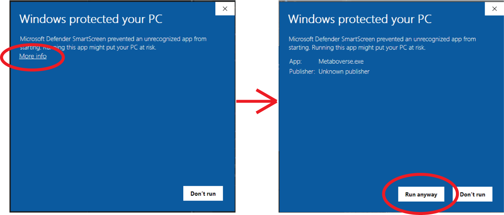
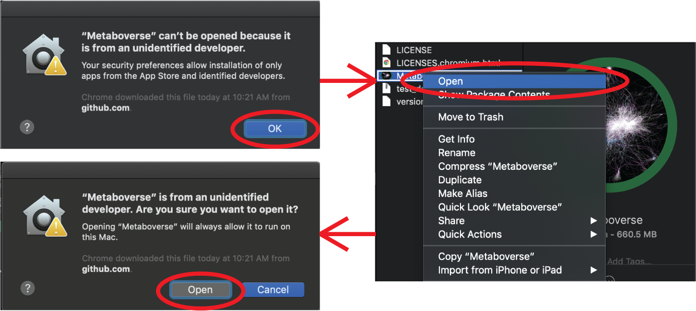
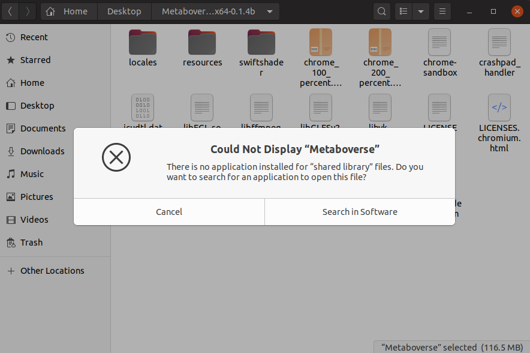

############
Installation
############

--------------------
Basic requirements:
--------------------
| * 64-bit macOS, Windows, or Linux operating system
| * >= 4 GB RAM
| * >= 5 GB of open storage space
| * Internet connection (for curating step)

----------------------------
Installation Instructions:
----------------------------
| 1) Go to `https://github.com/Metaboverse/Metaboverse/releases <https://github.com/Metaboverse/Metaboverse/releases>`_
| 2) Click on the most recent release of Metaboverse
| 3) Under the Assets tab, click the appropriate file for your computer's operating system (:data:`darwin` for macOS, :data:`win32` for Windows, and :data:`linux` for Linux-based operating systems)
| 4) Unzip the downloaded file
| 5) Double-click the Metaboverse icon (named :data:`Metaboverse`)

---------------------
Permissions Notice
---------------------
| In all foreseeable cases, you will likely see some sort of access warning when launching Metaboverse. This is due to the software being unsigned. This basically boils down to us (the developers) not being in the registered databases of Apple- or Windows-certified developers, as this cumulatively can cost several hundred dollars. This obviously comes with some inherent risks, but if Metaboverse sees considerable enough attention and use, we will look into investing in this signing ability. Please reach out to us in the `Issues forum <https://github.com/Metaboverse/Metaboverse/issues>`_ for any questions. But for now, please do the following when launching Metaboverse on the following platforms:

| **Windows**

| **macOS**

| **Linux**
| If you click on the Metaboverse app for Linux and you see the following error:

| you should perform the following steps in the Terminal.
.. code-block:: shell

  $ cd /path/to/unzipped/metaboverse/app/folder
  $ chmod +x ./Metaboverse
  $ chmod +x ./resources/app/python/metaboverse-cli-linux
| and then launch the app by executing the following:
.. code-block:: shell

  $ ./Metaboverse
