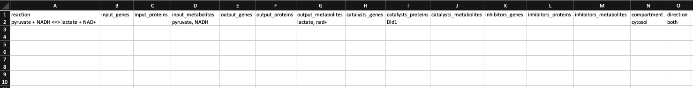

.. _other_link:

##############
Other Features
##############

-------------------------
Adding a custom reaction
-------------------------
| Metaboverse primarily relies on annotated reactions as contained in the `Reactome <https://reactome.org/>`_ for a given organism. As such, a reaction may exist or exist in another organism that is not annotated in your organism of interest.
| In order to add a reaction, provide a tab-delimited file in the Variables page for Metaboverse. Each line below the table headers should represent an independent reaction record. An example is displayed below (click on the image to enlarge). Fields that are not needed for a given reaction can be left blank.
|
| - **reaction**: Display reaction name
| - **input_genes**: A list of input genes for the reaction. Each entity should be separated by a comma.
| - **input_proteins**: A list of input proteins for the reaction. Each entity should be separated by a comma.
| - **input_metabolites**: A list of input metabolites for the reaction. Each entity should be separated by a comma.
| - **output_genes**: A list of output genes for the reaction. Each entity should be separated by a comma.
| - **output_proteins**: A list of output proteins for the reaction. Each entity should be separated by a comma.
| - **output_metabolites**: A list of output metabolites for the reaction. Each entity should be separated by a comma.
| - **catalyst_genes**: A list of catalyst genes for the reaction. Each entity should be separated by a comma.
| - **catalyst_proteins**: A list of catalyst proteins for the reaction. Each entity should be separated by a comma.
| - **catalyst_metabolites**: A list of catalyst metabolites for the reaction. Each entity should be separated by a comma.
| - **inhibitor_genes**: A list of inhibitor genes for the reaction. Each entity should be separated by a comma.
| - **inhibitor_proteins**: A list of inhibitor proteins for the reaction. Each entity should be separated by a comma.
| - **inhibitor_metabolites**: A list of inhibitor metabolites for the reaction. Each entity should be separated by a comma.
| - **compartment**: The cellular compartment the reaction occurs in.
| - **direction**: The direction of the reaction. Should be "forward", "reverse", or "both".

.. image:: images/add_reactions.gif
  :width: 700
  :align: center
|
