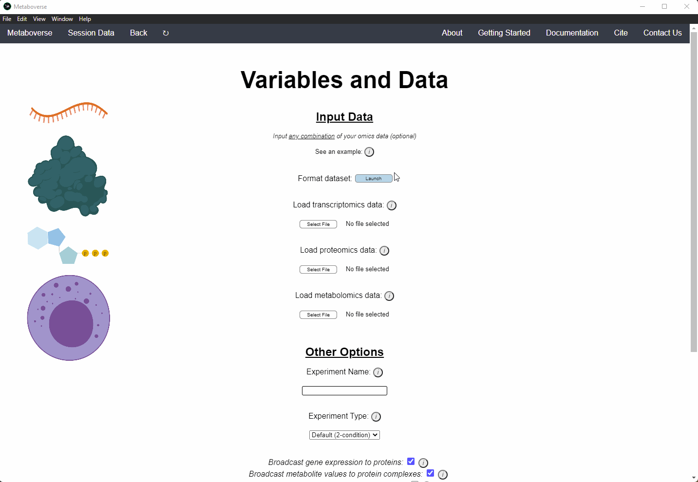

.. _other_link:

##############
Other Features
##############

.. _format_link:
===============================
Data Formatting Help
===============================
| 1. On the :data:`Variables` page of Metaboverse, launch the :data:`Format dataset` module.
| 2. Upload your datatable. The datatable's first column should be a blank cell, followed by each of the measured entities' names. Each subsequent column should start with the sample name, followed by the corresponding measurements for each measured entity.
| 3. By default, calculated p-values will use the `Benjamini-Hochberg p-value adjustment procedure <https://www.jstor.org/stable/2346101>`_ for multiple hypothesis testing. This is a less conservative adjustment procedure ideal for exploratory data analysis. If you do not wish to use a p-value correction procedure, uncheck the appropriate box. 

.. note::
  The statistical procedures used by this module assume data are normally distributed, such as is the case with proteomics and metabolomics data. However, for transcriptomics data, which 
  follow a negative binomial distribution, a package, such as `DESeq2 <https://bioconductor.org/packages/release/bioc/html/DESeq2.html>`_ or 
  `limma <https://bioconductor.org/packages/release/bioc/html/limma.html>`_ should be used. The resulting fold change and adjusted p-values should then be isolated from the results, exported 
  into a tab-delimited file, and uploaded for use in Metaboverse.
  
| 4. Select the experiment type used.
| 5. Provide a label for the comparison, or use the default name, and select the contol and experimental samples from the columns and assign to their appropriate group by clicking the group  button (:data:`Control` or :data:`Experiment`).
| 6. For multi-condition or time-course experiments, continue to add additional groups.
| 7. For metabolomics data, click the :data:`Check Names` button to cross-reference the names you provided with `MetaboAnalyst <https://www.metaboanalyst.ca/docs/APIs.xhtml>`_ to improve the chances that the metabolite correctly maps  to the metabolic network.
| 8. Export your formatted datatable.

===============================
Tracing Metabolomics Data 
===============================
| Currently, Metaboverse does not contain any integrated methods for handling tracing/flux metabolomics data. We chose to do so for a couple of reasons:
| 1. Coupling tracing metabolomics with reaction pattern searches, reaction collapses, and the other features of Metaboverse would add more dimensionality that would reduce the effectiveness of what Metaboverse has to offer.
| 2. Tracing metabolomics can be difficult to automate pattern searches across. For example, M+4 vs M+5 citrate could imply drastically different metabolic outcomes and is better suited for manual analysis.
| 3. `Escher-Trace <https://escher-trace.github.io/>`_ is a publicly available visualization tool that already provides the capabilities to analyze tracing data.

| We strongly suggest users interested in analyzing tracing data in conjunction with Metaboverse to check out `Escher-Trace <https://escher-trace.github.io/>`_. For such an analysis, users might consider analyzing the different 
ionization products with `Escher-Trace <https://escher-trace.github.io/>`_ and analyzing derived steady-state metabolomics data (i.e. M+0) with Metaboverse's reaction pattern search engine. Cross-referencing the outputs of 
these two tools may then provide biological clues for their system, such as to the downstream outcomes of differential metabolite behavior.

..
  ===============================
  Single Cell RNA-Sequencing 
  ===============================
  | 
  ===============================
  Adding a custom reaction
  ===============================
  | Metaboverse primarily relies on annotated reactions as contained in the `Reactome <https://reactome.org/>`_ for a given organism. As such, a reaction may exist or exist in another organism 
  that is not annotated in your organism of interest.
  | In order to add a reaction, provide a tab-delimited file in the Variables page for Metaboverse. Each line below the table headers should represent an independent reaction record. An example 
  is displayed below (click on the image to enlarge). Fields that are not needed for a given reaction can be left blank.
  |
  | - **reaction**: Display reaction name
  | - **input_genes**: A list of input genes for the reaction. Each entity should be separated by a comma.
  | - **input_proteins**: A list of input proteins for the reaction. Each entity should be separated by a comma.
  | - **input_metabolites**: A list of input metabolites for the reaction. Each entity should be separated by a comma.
  | - **output_genes**: A list of output genes for the reaction. Each entity should be separated by a comma.
  | - **output_proteins**: A list of output proteins for the reaction. Each entity should be separated by a comma.
  | - **output_metabolites**: A list of output metabolites for the reaction. Each entity should be separated by a comma.
  | - **catalyst_genes**: A list of catalyst genes for the reaction. Each entity should be separated by a comma.
  | - **catalyst_proteins**: A list of catalyst proteins for the reaction. Each entity should be separated by a comma.
  | - **catalyst_metabolites**: A list of catalyst metabolites for the reaction. Each entity should be separated by a comma.
  | - **inhibitor_genes**: A list of inhibitor genes for the reaction. Each entity should be separated by a comma.
  | - **inhibitor_proteins**: A list of inhibitor proteins for the reaction. Each entity should be separated by a comma.
  | - **inhibitor_metabolites**: A list of inhibitor metabolites for the reaction. Each entity should be separated by a comma.
  | - **compartment**: The cellular compartment the reaction occurs in.
  | - **direction**: The direction of the reaction. Should be "forward", "reverse", or "both".

  .. image:: images/add_reactions.png
    :width: 700
    :align: center

  .. image:: images/add_reactions.gif
    :width: 700
    :align: center
  |
