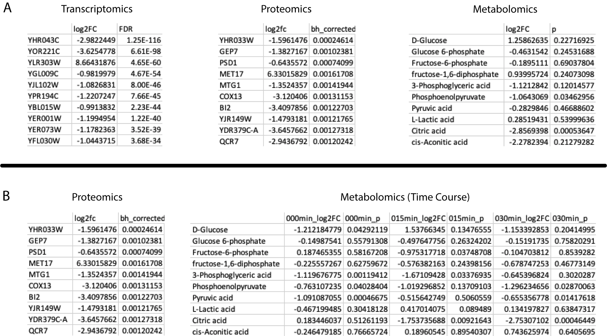
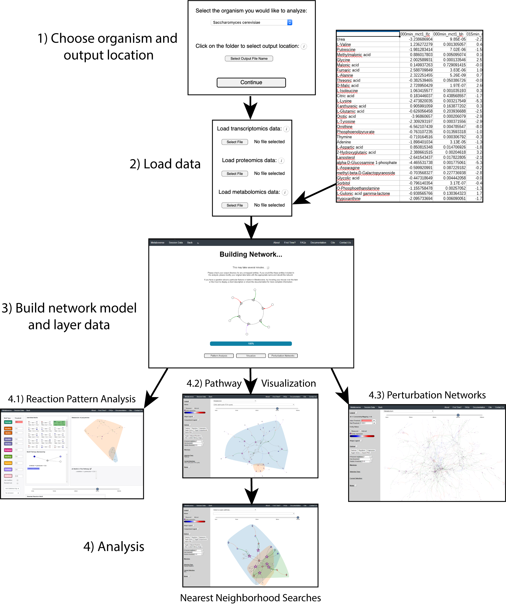

.. _overview_link:

############
Overview
############

--------------
Background
--------------
| Metaboverse is a cross-platform app built to aid users in contextualizing their data on their model's metabolic and global reaction network. Metaboverse is an interactive tool for exploratory data analysis that searches user data in the context of the metabolic network to identify interesting patterns and trends within the data. Metaboverse will aid users in interactively identifying interesting patterns and regulatory hotspots within their data for further experimental follow-up.
|
-----------------
Data Inputs
-----------------
| Metaboverse is capable of handling several data types and structures. Users can input a combination of paired transcriptomics, proteomics, and metabolomics data for their model. Metaboverse relies on Ensemble IDs, UniProt IDs, and ChEBI IDs for data mapping, so any data type that is able to map back to one of these data types can be used. For example, ribosome profiling translation efficiency data mapped to Ensembl gene IDs can be overlaid on the network. Data format consists of row names with the entities of interest, a column of log2 Fold Change data, and a column of a statistical value. An example for each datatype can be seen below, where (A) shows single-condition datatable examples, and (B) shows a single-timepoint proteomics dataset paired with a timecourse metabolomics dataset.

|
| Along with single condition experiment set-ups, users can provide timecourse data by sequentially listing the fold change and statistical columns in temporal order in the input data table for that -omic type. Users can provide all paired -omics types for each time point, or provide one -omics table of timecourse data and a table for another -omics type with a single steady-state time point. In every situation, it is vital the user keeps in mind the caveats associated with comparing such mixed data types. Along with timecourse data, users can provide multiple conditions formatted as with the timecourse data.
|
| **TL;DR**
| * Each omic input should include fold change and statistal values.
| * Timecourse data should be repeated fold change and statistical values for each timepoint in order.
| * Multi-condition experiments can be provided as with timecourse data.
| * Data names should correspond to Ensembl, UniProt, or ChEBI ID and acceptable synonyms.
|
-------------------
Using Metaboverse
-------------------
| Metaboverse first asks users for the organism of interest and an output folder to store all output data and network representations. Afterwards, the user will be directed to provide any -omics data tables, along with some basic metadata, such as experimental setup, timecourse labels, etc. After this input is provided, the network will be modeled with the user's data overlaid. Two files will then be output to the location specified by the user. The first will be a file ending in :data:`.pickle`, which contains the basic information needed to model the organism network without user data. This file can be saved for future usage if the user wishes to remodel data on that organism's network without have to wait for all the necessary source files to download. This file can be provided in leiu of the organism name and file output on the appropriate page.
|
| The second file ends in :data:`.json` and contains the final network with the user data and user metadata stored. This file will allow for all downstream visualizations and analyses and can be reloaded on the main page of Metaboverse to quickly re-analyze a dataset. Clicking on the :data:`Session Data` tab in the menu on each page of Metaboverse will display the appropriate metadata for that particular model.
|
| The figure below shows an example of this process.

| For more details on using each analytical feature within Metaboverse, please refer to the :ref:`general_link` page.
|
| **TL;DR**
| * Users specify organism, output location, -omics files, and basic experimental metadata by following the prompts.
| * User data is layered onto the reaction network.
| * :data:`.pickle` and :data:`.json` files can be saved to quickly access the organism curation or data model.
| * Once data is modeled on the network, the user can begin interactive analysis of their data.
|
------------------------------------------
Important Features of Metaboverse
------------------------------------------
| While many tools currently available provide capabilities to analyze data on metabolic networks, we introduce several new or improved features in metabolic network analysis that aid in more robust, unbiased network analysis of biological data. These features are outlined below:
|
| * **Collapsing data sparsity**: Due to the challenges in metabolomics revolving around missing values for metabolites in a reaction pathway, data sparsity can impede in the analytical process. We address this issue by introducing a reaction collapse scheme, that creates pseudo-reactions where up to 3 reactions have missing data points between the reactions, but the external ends of the reactions in this sub-path have measured values.
|
| * **Dynamic Network Visualization**: The Metaboverse provides an interactive app that allows for dynamic exploration of regulatory hotspots, perturbation networks, and general visualization. Users can add or remove metabolites or other entities from being visualized, which is particularly useful in cases of highly connected metabolites, such as water, which clutter the visualization and do not contribute much to the interpretation of the data. Users can toggle on or off labels and features, drag and rearrange components of the networks, and more.
|
| * **Identifying Regulatory Hotspots**: In order to identify reactions where interesting regulatory events are occurring based on the provided -omic data, we introduce a regulatory hotspot search engine, which is based on concepts from `activity motifs <https://www.nature.com/articles/nbt.1499>`_. Several hotspot patterns are pre-programmed into Metaboverse to allow the users to explore different regulatory patterns present in the data. In the future, we plan to include an interactive interface to allow users to design and implement custom search patterns.
|
| * **Modeling Perturbed Connectivity**: Users can specify the threshold needed to consider a reaction perturbed and stitch together each of these reactions passing the threshold to reveal a perturbation network. This allows for the visualization of connected perturbations along a pathway and may indicate interesting characteristics of a condition that may complicate certain treatments if, for example, a drug targets a perturbed reaction, but the reaction downstream is also perturbed for independent reasons from the first and could thus reduce efficacy of the drug treatment.
|
-------------------
Performance
-------------------
| Performance will vary network to network. For example, the curation and modeling of data on a yeast network will process several times faster than data modeled on a human network. You may experience a network taking longer to curate, but as long as no error messages appear, it is probably still working.
