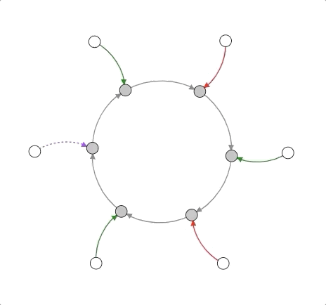

##############
Metaboverse
##############
|build-status| |docs|

=================
About
=================
| `Metaboverse <https://https://github.com/Metaboverse/Metaboverse>`_ allows for the interactive exploration of metabolic pathways, integrating transcriptomics, proteomics, metabolomics data and more.
|
| To access the most recent version of our manuscript describing Metaboverse, please click `here <https://github.com/Metaboverse/manuscript/blob/master/output/manuscript.pdf>`_.
|
=================
Table of contents
=================
.. toctree::
   :hidden:

   self

.. toctree::
   :maxdepth: 1

   content/overview
   content/installation
   content/general-usage
   content/faqs
   content/updates

=======
License
=======
| `Metaboverse <https://https://github.com/Metaboverse/Metaboverse>`_ is developed and maintained by Jordan Berg in the `Rutter Lab <https://biochem.utah.edu/rutter/index.html>`_ @ the `University of Utah <https://www.utah.edu/>`_, along with other collaborators. We welcome pull requests if you would like to contribute to the project.
|
| `Metaboverse <https://github.com/Metaboverse/Metaboverse>`_ is perpetually open source under a GNU General Public License (v3.0).
|
==========
Questions?
==========
| If you have questions, requests, or bugs to report, please use the `Metaboverse issues forum <https://github.com/Metaboverse/Metaboverse/issues>`_.
|

.. |build-status| image:: https://travis-ci.org/Metaboverse/Metaboverse.svg?branch=master
    :target: https://travis-ci.org/Metaboverse/Metaboverse
    :alt: Build Status

.. |docs| image:: https://readthedocs.org/projects/metaboverse/badge/?version=latest
    :target: https://metaboverse.readthedocs.io/en/latest/?badge=latest
    :alt: Documentation Status
